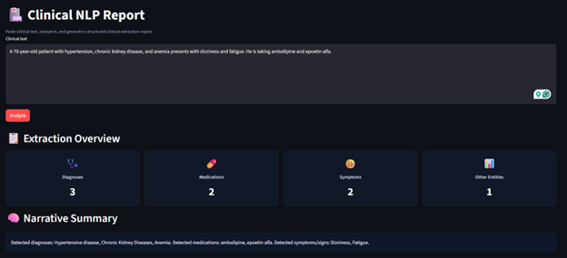
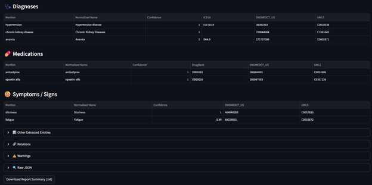

# 🏥 Clinical NLP Analyzer


### 🚀 AI-Powered Healthcare Text Intelligence Platform  
👤 **Author:** Sabin Shrestha  
🛠️ **Built with:** Azure AI • FastAPI • Streamlit • Docker  
📅 **Date:** March 26, 2026 
🏷️ **Version:** v1.0.0

---

# 🔥 Overview

Healthcare systems generate massive amounts of **unstructured clinical data**.

👉 This application transforms that into:

- Structured clinical data  
- Standardized medical coding  
- Actionable insights 

---

# 🖥️ Application Preview

## 🧠 Dashboard Overview


---

## 📊 Extraction Results


---

# ✨ Key Features

- 🩺 Extract Diagnoses, Medications, Symptoms  
- 🔗 Map to ICD-10, SNOMED CT, UMLS, DrugBank  
- 🧠 AI-powered clinical understanding  
- 📊 Clean dashboard UI  
- 📥 Downloadable reports  
- 🐳 Fully Dockerized (production-ready)

---

## 🧠 Architecture

```
[ Streamlit UI ]  →  [ FastAPI Backend ]  →  [ Azure Healthcare NLP ]
         (8501)              (8000)                  (5000)
```

---

## 🛠️ Tech Stack

| Layer | Technology |
|------|-----------|
| Frontend | Streamlit |
| Backend | FastAPI |
| AI/NLP | Azure Text Analytics for Health |
| Deployment | Docker Compose |

---

## ⚙️ Prerequisites

- Docker Desktop (running)
- VS Code
- Azure Text Analytics (Language) resource

---

## ☁️ Azure Setup

Create:

- Resource Type: **Text Analytics / Language**
- Endpoint:
```
https://<your-resource>.cognitiveservices.azure.com/
```
- API Key

✅ Free or Standard tier both work

---

## ⚙️ Setup Instructions

### 1. Clone or Open Project

```
File → Open Folder → healthcare-nlp-app
```

---

### 2. Update `docker-compose.yml`

```
- eula=accept
- billing=https://YOUR-ENDPOINT.cognitiveservices.azure.com/
- apikey=YOUR_KEY
- rai_terms=accept
```

---

## ▶️ Run Application

Open terminal in VS Code:

```
docker compose down --volumes
docker compose up --build
```

---

## 🌐 Access

| Service | URL |
|--------|-----|
| UI | http://localhost:8501 |
| API | http://localhost:8000 |

---

## 🧪 Example Input

```
The patient was diagnosed with type 2 diabetes and prescribed metformin and insulin. He reports fatigue and thirst.
```

---

## 📊 Output

- Dashboard summary
- Diagnoses table
- Medications table
- Symptoms table
- Medical codes mapping
- JSON + downloadable report

---

## 🧬 Medical Coding Systems

| System | Purpose |
|------|--------|
| ICD-10 | Billing |
| SNOMED CT | Clinical |
| UMLS | Mapping |
| DrugBank | Drugs |

---

## 🌍 Access from Another Computer

1. Get IP:
```
ipconfig
```

2. Allow firewall:
```
netsh advfirewall firewall add rule name="Streamlit 8501" dir=in action=allow protocol=TCP localport=8501
```

3. Open:
```
http://YOUR-IP:8501
```

---

## 🛠️ Useful Commands

```
docker compose up --build
docker compose down
docker compose logs -f
docker ps
```
---
# 📦 Version

**Current Version:** v1.0.0  

Initial release featuring:
- Clinical NLP extraction (Azure Text Analytics for Health)
- FastAPI backend
- Streamlit dashboard UI
- Dockerized deployment
- Structured clinical output with coding systems (ICD-10, SNOMED, UMLS, DrugBank)
---
# 📝 Changelog

## v1.0.0 — Initial Release (March 26, 2026)

### 🚀 Features
- Extract diagnoses, medications, and symptoms from clinical text
- Map entities to ICD-10, SNOMED CT, UMLS, and DrugBank
- Interactive Streamlit dashboard with summary metrics
- FastAPI backend for processing requests
- Azure Text Analytics for Health integration
- Docker Compose multi-service architecture

### 🎨 UI Improvements
- Dashboard cards with icons
- Narrative summary generation
- Structured tables for extracted entities

### 📊 Output
- Clean JSON response
- Downloadable text report

---

## 🔮 Upcoming (Planned)

- PDF report generation
- Azure OpenAI clinical summary
- File upload (clinical notes / PDFs)
- Chat interface (RAG-based)
- Azure deployment (Container Apps)
- Authentication & multi-user support

## 🚀 Future Enhancements

- 📄 PDF Reports  
- 🤖 AI Summary (LLM)  
- 📁 File Upload  
- ☁️ Azure Deployment  
- 💬 Chat with Clinical Data  

---

## 👤 Author

**Sabin Shrestha**  
AI • Data Engineering • Healthcare Analytics  

---

## ⭐ Why This Project Matters

👉 Converts messy clinical text → structured, billable, analyzable data  

👉 Real-world use cases:
- EHR systems
- Insurance coding
- Clinical analytics
- AI pipelines

---

## 📌 Final Note

This is not just an NLP demo —  
it is a **production-ready healthcare AI system**.
